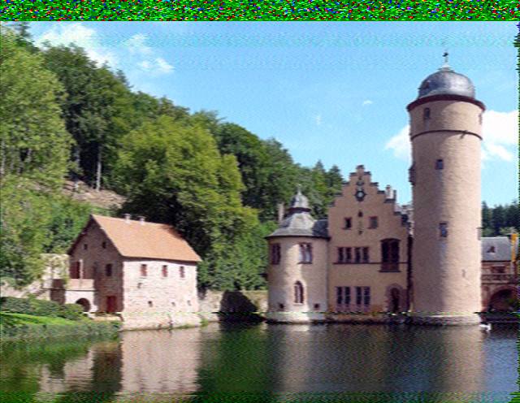
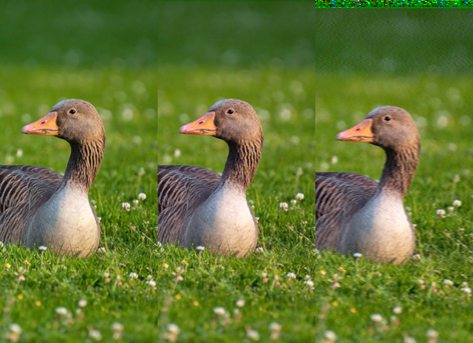

# rtlsdr_sstv

Este fue un trabajo final para Radiocomunicaciones.

Consiste de un modulador y un demodulador de SSTV modo PD-120 que es el modo
usado para las transmisiones que hace la ISS. No lo usamos para demodular
directamente imágenes transmitidas por la ISS pero sí demodulamos grabaciones en
WAV que teníamos de pasadas anteriores.

Pudimos transmitir imagenes con un LimeSDR mini para recibirlas con un RTLSDR en
otra PC.

[Ver informe final](./informe/informe.pdf)

[Ver presentación](./informe/presentacion.pdf)

## En que quedó

Esta otra imagen compara la calidad de (de iquierda a derecha):

- Imagen original

- Modulación de muestras listas para transmitir hacia un archivo RAW y
    demodulación desde ese mismo archivo.

- Imagen transmitida entre los SDR

Lo que tiene de malo nuestro modulador/demodulador es que lo escribimos a las
apuradas, está todo así nomás y que es MUY lento. Suele tardar más de un minuto
en modular o demodular, ni intentamos hacerlo en tiempo real.

Busqué rápido pero no encontré que es lo que hace tan lentas las cosas, tarda
mucho en las cosas más exigentes como convoluciones pero igual no debería tardar
tanto si comparo con
[mi otro demodulador hecho en Rust](https://github.com/martinber/noaa-apt),
Python es más lento pero no tanto. A lo mejor tendríamos que haber usado más
Numpy.

## Notas

### Notas sobre modos SSTV

- http://www.classicsstv.com/pdmodes.php

- Explicaciones sobre todos los modos: http://www.sstv-handbook.com/download/sstv_04.pdf

- Codigos que usa los modos: http://www.g0hwc.com/sstv_modes.html

- Sitio sobre SSTV con audio: https://www.nonstopsystems.com/radio/frank_radio_sstv.htm

- Info varia y links: https://inst.eecs.berkeley.edu/~ee123/fa12/project.html

- Sobre demodulacion avanzada: http://lionel.cordesses.free.fr/gpages/Cordesses.pdf

- Resolución 640x496.

- Tiempo de transmisión 120s. Aunque segun
    [esta pagina](http://f1ult.free.fr/DIGIMODES/MULTIPSK/sstv_en.htm) son 126s.

### Espectrograma de QSSTV

Esto es lo que muestra el espectrograma de la derecha del programa QSSTV.

There are three markers for SSTV (red lines):

- 1200: Sync frequency

- 1500: Lower video frequency

- 2300: Upper video frequency In DRM, the markers indicate the 3 unmodulated carrier frequencies

### Librerías usadas

- Pillow

- Numpy

- Matplotlib.

- Scipy

- SoapySDR

### Tutoriales y ejemplos

- Demodulacion FM: https://witestlab.poly.edu/blog/capture-and-decode-fm-radio/#tldrversion

- Transmision de SSB usando SoapySDR: https://github.com/pothosware/SoapySDR/blob/master/python/apps/SimpleSiggen.py

### Sobre LimeSDR

- https://www.crowdsupply.com/lime-micro/limesdr-mini

- https://wiki.myriadrf.org/LimeSDR-Mini

### Ejemplo de transmisor de SSTV

https://github.com/dnet/pySSTV

### Para hacer muestras de 16 bit

http://blog.acipo.com/wave-generation-in-python/
